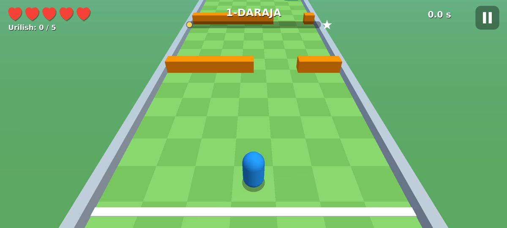
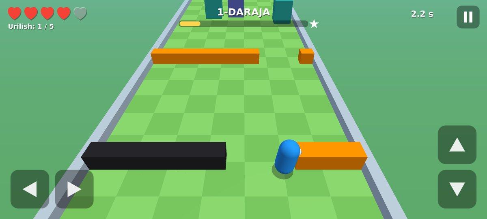
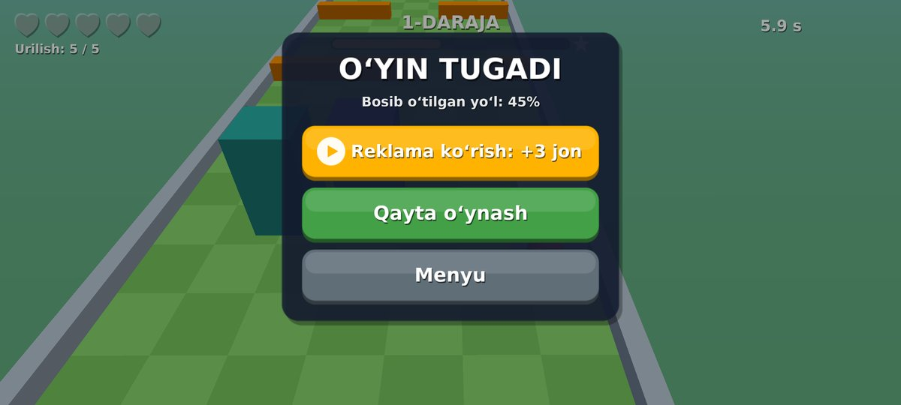
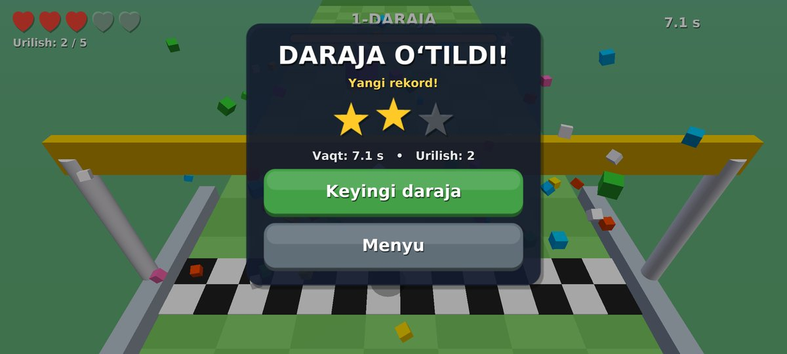

# Obstacle Dodge — toʻsiqlardan qochish oʻyini (C#)

**Dodgy** (koʻk kapsula) yoʻl boʻylab yugurib, toʻsiqlarga urilmasdan **MARRA**ga yetib borishi kerak.
5 marta urilsangiz — **OʻYIN TUGADI**. Reklama koʻrib **+3 jon** olib davom etish mumkin.

Loyiha sizning ikkita qoʻllanmangiz asosida qilingan
(*Obstacle Dodge From Scratch* va *Ads in Obstacle Dodge*), hamma kod **C#** da.

| Menyu | Oʻyin |
|---|---|
|  |  |
| **Oʻyin tugadi + reklama tugmasi** | **Daraja oʻtildi** |
|  |  |

---

## 📱 APK — telefonga oʻrnatish

**Yuklab olish:** [ObstacleDodge.apk (eng soʻnggi versiya)](https://github.com/workhardpatience1/my-project/releases/download/latest-apk/ObstacleDodge.apk)
— yoki repozitoriydagi [`apk/ObstacleDodge.apk`](apk/ObstacleDodge.apk) fayli.

1. APK faylni telefonga yuklab oling (Android **7.0** yoki undan yangi).
2. Faylni oching. Telefon soʻrasa: *Sozlamalar → Nomaʼlum manbalardan oʻrnatishga ruxsat* bering.
3. **Oʻrnatish** → **Ochish**. Oʻyin yotiq (landshaft) holatda ochiladi.

APK har safar kod oʻzgarganda GitHub Actions tomonidan **avtomatik** qayta yigʻiladi
(`.github/workflows/android-apk.yml`) va yuqoridagi havola yangilanadi.

## 🎮 Oʻyin

* **Boshqaruv (telefon):** chap pastda ◀ ▶, oʻng pastda ▲ ▼ — ikki bosh barmoq bilan bir vaqtda (diagonal ham yuradi).
* **Boshqaruv (kompyuter):** WASD yoki strelkalar, `Esc` — pauza, `Enter` — asosiy tugma.
* **Toʻsiqlar** (qoʻllanmadagi kabi): devor (Wall), kichik bino (Small building), aylanuvchi (Spinning Thing),
  osmondan tushadigan quti (Dropping Object), qizil tuzoq zonasi + 5 ta oʻq (Trigger Volume + Projectile),
  keyingi darajalarda — siljuvchi devor.
* Har bir toʻsiq faqat **bir marta** hisoblanadi va **qora** rangga kiradi (ObjectHit).
* **Darajalar cheksiz:** har bir daraja uzunroq va qiyinroq. Har bir darajada albatta oʻtish yoʻli bor
  (1–60 darajalar avtomatik test bilan tekshirilgan).
* Marraga yetsangiz — **yulduzlar**: 0 urilish = ⭐⭐⭐, 1–2 = ⭐⭐, koʻproq = ⭐.
* Progress (ochilgan daraja, rekord, ovoz) telefonda saqlanadi.

## 💰 Reklama

APK da **Google AdMob** ulangan (qoʻllanmadagi uchta reklama turi):

| Tur | Qachon chiqadi |
|---|---|
| **Banner** (320×50) | Doim ekranning pastki markazida; tugmalar unga tegmaydi |
| **Rewarded** (mukofotli) | Faqat oʻyinchi *“Reklama koʻrish: +3 jon”* tugmasini bossa (bir raundda bir marta) |
| **Interstitial** (toʻliq ekran) | Har **3-chi** “Qayta oʻynash”/“Keyingi daraja”da, lekin 60 soniyadan tez-tez emas |

> ⚠️ **Hozir Google'ning rasmiy TEST reklamalari qoʻyilgan** — ular “Test Ad” deb koʻrinadi va pul keltirmaydi.
> Bu ataylab: oʻz haqiqiy reklamangizni oʻzingiz bossangiz, AdMob akkauntni bloklaydi.

### Haqiqiy reklamaga oʻtish (pul ishlash uchun)

1. [admob.google.com](https://admob.google.com) da roʻyxatdan oʻting, toʻlov va soliq maʼlumotlarini toʻldiring.
2. **Apps → Add app → Android**, paket nomi: `com.workhardpatience.obstacledodge`.
3. 3 ta **Ad unit** yarating: *Banner*, *Interstitial*, *Rewarded*.
4. Ularning ID larini quyidagi fayllarga yozing:
   * `ObstacleDodge.MonoGame/ObstacleDodge.Android/AdIds.cs` — 3 ta ad unit ID;
   * `ObstacleDodge.MonoGame/ObstacleDodge.Android/AndroidManifest.xml` — **App ID** (`ca-app-pub-...~...`).
5. Commit + push qiling — GitHub Actions yangi APK yigʻadi.
6. Oʻz telefoningizni AdMob'da **test device** qilib qoʻshing va oʻz reklamangizni **hech qachon bosmang**.
7. Ilova Google Play'da boʻlsa, saytingizga `app-ads.txt` qoʻying (AdMob koʻrsatmasi boʻyicha).

---

## 📂 Loyiha tuzilishi

Repozitoriyda oʻyinning **ikki versiyasi** bor, ikkalasi ham C#:

### 1) `ObstacleDodge.MonoGame/` — APK shu yerdan (C# + MonoGame + .NET for Android)

| Fayl | Qoʻllanmadagi skript | Vazifasi |
|---|---|---|
| `Shared/World/Mover.cs` | Mover.cs | Klaviatura + ekran tugmalari bilan yurish |
| `Shared/World/Obstacle.cs` | ObjectHit.cs | Birinchi urilishda hisoblash, qora rang, “Hit” belgisi |
| `Shared/World/Obstacles.cs` | Spinner, Dropper, FlyAtPlayer, TriggerProjectile | Toʻsiqlar va tuzoqlar |
| `Shared/Core/GameManager.cs` | GameManager.cs | Urilishlar, Game Over, +3 jon, qayta boshlash, darajalar |
| `Shared/Core/AdManager.cs` | AdManager.cs | Reklama uchun yagona joy |
| `Shared/UI/GameUI.cs` | GameUI.cs | Yuraklar, menyu, Game Over/pauza/daraja oynalari |
| `Shared/UI/TouchControls.cs` | TouchControls.cs | Telefon uchun strelka tugmalari |
| `Shared/World/LevelGenerator.cs` | (Part 6) | Darajani qurish |
| `ObstacleDodge.Android/` | (Part 5) | Android ilova + **AdMob** (`AdMobAds.cs`, `AdIds.cs`) |
| `ObstacleDodge.Desktop/` | — | Kompyuter versiyasi (Windows/Linux/macOS) + avtomatik skrinshot testi |
| `ObstacleDodge.Tests/` | — | Mantiq testlari (25 ta) |

Mahalliy yigʻish (.NET 10 SDK kerak):

```bash
cd ObstacleDodge.MonoGame
dotnet run --project ObstacleDodge.Tests -c Release          # testlar
dotnet run --project ObstacleDodge.Desktop -c Release        # kompyuterda oʻynash
dotnet workload install android                              # bir marta
dotnet publish ObstacleDodge.Android -c Release -o out       # APK -> out/*-Signed.apk
dotnet publish ObstacleDodge.Android -c Release -p:AndroidPackageFormat=aab \
  -p:AndroidSigningKeyStore=release.keystore -p:AndroidSigningKeyAlias=... \
  -p:AndroidSigningStorePass=... -p:AndroidSigningKeyPass=...   # Google Play uchun AAB
```

> `debug.keystore` — bu ochiq **test** kaliti (paroli `android`), APK lar bir xil imzoga ega boʻlishi uchun.
> **Google Play uchun** oʻzingizning yopiq kalitingizni yarating va uni hech qachon repozitoriyga qoʻymang:
> `keytool -genkeypair -keystore release.keystore -alias obstacledodge -keyalg RSA -keysize 2048 -validity 10000`

### 2) `ObstacleDodge.Unity/` — qoʻllanmadagi Unity 6 loyihasi (C#)

Qoʻllanmadagi barcha skriptlar `Assets/Scripts/` da: `Mover`, `Scorer`, `ObjectHit`, `Spinner`, `Dropper`,
`FlyAtPlayer`, `TriggerProjectile`, `GameManager`, `GameUI`, `AdManager`, `TouchControls`
(+ `LevelBuilder`, `FollowCamera`, `FinishLine`, `SlidingWall`). WebGL uchun `Plugins/WebGL/WebAds.jslib`
va `WebGLTemplates/ObstacleDodge/index.html` (Monetag + Adsterra joylari).

* **Ochish:** Unity Hub → *Add project from disk* → `ObstacleDodge.Unity` papkasi (Unity **6000.0.x**). ▶ Play bosing.
  Daraja sahnaga qoʻlda emas, `LevelBuilder.cs` orqali **kod bilan** quriladi (qoʻllanmadagi Part 3–6 ning aynan oʻzi).
* **“Hit” tegi** va tavsiya etilgan sozlamalar (paket nomi, landshaft, IL2CPP + ARM64, minSdk 24) loyiha
  ochilganda avtomatik qoʻyiladi (`Editor/ProjectSetup.cs`). Menyu: **Obstacle Dodge → Apply recommended settings**.
* **APK:** menyu **Obstacle Dodge → Build Android APK** → `Builds/Android/ObstacleDodge.apk`.
* **LevelPlay reklamasi (qoʻllanma, Part 5):** *Window → Package Manager → Unity LevelPlay* ni oʻrnating —
  `LEVELPLAY_INSTALLED` belgisi avtomatik qoʻshiladi va `AdManager` haqiqiy SDK dan foydalanadi.
  LevelPlay saytidagi App Key va 3 ta Ad Unit ID ni sahnadagi **AdManager** obyektiga yoki `AdManager.cs` dagi
  maydonlarga yozing. Paket oʻrnatilmagan boʻlsa ham loyiha xatosiz yigʻiladi (reklama oʻrniga “stub”).
* **Bulutda yigʻish (ixtiyoriy):** `.github/workflows/unity-build.yml` — `UNITY_EMAIL`, `UNITY_PASSWORD`,
  `UNITY_LICENSE` secret larini qoʻshing va *Actions → Unity build → Run workflow* bosing.

---

## 🏪 Google Play'ga chiqarish (qisqacha)

1. Google Play Console akkaunti (bir martalik toʻlov).
2. AAB yigʻing (yuqoridagi buyruq) va **oʻz** kalitingiz bilan imzolang.
3. *App content*: **Ads** — “Ha, reklama bor”; **Data safety** — AdMob reklama ID sini yigʻadi;
   **Privacy policy** havolasi shart; yosh reytingi. Bolalar (13 yoshgacha) uchun boʻlsa — Families qoidalari.
4. Har yangi versiyada `ApplicationVersion` (`ObstacleDodge.Android.csproj`) ni oshiring.

## ✅ Nima tekshirilgan / ❗ nima tekshirilmagan

* ✅ 25 ta mantiq testi (urilishlar, 5-chi urilishda Game Over, +3 jon bir marta, har 3-chi qayta boshlashda
  interstitial, marra, saqlash, har bir 1–60 daraja oʻtsa boʻladi) — har bir build da GitHub Actions'da ishlaydi.
* ✅ Kompyuter versiyasi avtomatik oʻynatildi (menyu → oʻyin → Game Over → reklama → +3 jon → marra → keyingi daraja → pauza),
  skrinshotlar yuqorida.
* ✅ APK GitHub Actions'da AdMob bilan yigʻildi, imzosi (v2/v3) va ichidagi AdMob klasslari tekshirildi.
* ❗ APK haqiqiy telefonda **sinab koʻrilmadi** (yigʻish serverida Android emulyatori yoʻq). Birinchi oʻrnatishda
  menyu, tugmalar, banner va “Reklama koʻrish” tugmasini tekshirib koʻring.
* ❗ Unity loyihasi Unity muharririda ochib koʻrilmadi (serverda Unity yoʻq); runtime skriptlari UnityEngine
  kutubxonalariga qarshi kompilyatsiya qilib tekshirildi. LevelPlay qismi faqat paket oʻrnatilganda kompilyatsiya boʻladi.
